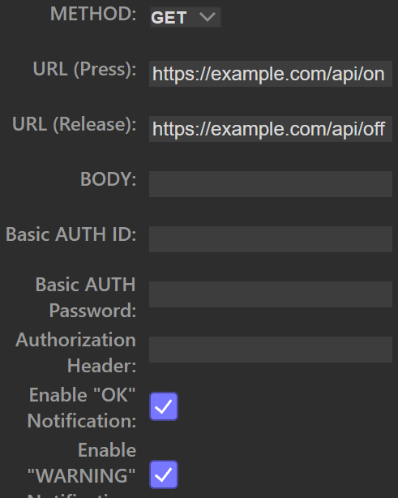
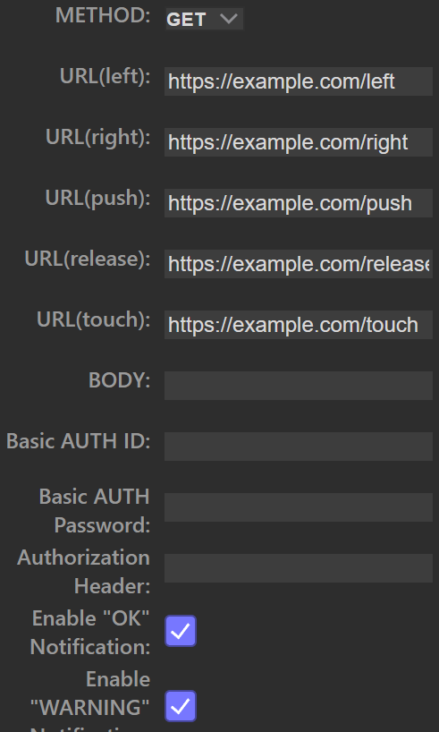

# Advanced HTTP Client（Stream Deck プラグイン）

Stream Deck のボタン／ダイヤル操作から任意の HTTP リクエストを送信するプラグインです。  
OBS や家電、自作 API など、URL で制御できる対象を Stream Deck から呼び出せます。

---

## ダウンロード

**[最新版をダウンロード](https://github.com/FlowingSPDG/streamdeck-advanced-http/releases/latest)**

Releases ページの `*.streamDeckPlugin`（例: `dev.flowingspdg.advancedhttp.streamDeckPlugin`）を取得してください。  
`Source code (zip/tar.gz)` はソース配布用です。

---

## インストール

1. ダウンロードした `.streamDeckPlugin` をダブルクリックする
2. Stream Deck ソフトウェアの確認ダイアログでインストールを実行する
3. アクション一覧に **Advanced HTTP Client [FlowingSPDG]** が表示されれば完了

---

## 使い方

1. Stream Deck ソフトウェアで空きボタンを選択する
2. アクション一覧から **HTTP REQUEST** をドラッグ＆ドロップする
3. Property Inspector で METHOD / URL などを設定する
4. 本体のボタンで動作を確認する

### 設定項目（ボタン）

| 項目 | 説明 |
| --- | --- |
| **METHOD** | HTTP メソッド（`GET` / `POST` / `PUT` / `DELETE` など） |
| **URL (Press)** | ボタン押下時に送信する URL。空欄なら送信しない |
| **URL (Release)** | ボタン解放時に送信する URL。空欄なら送信しない |
| **BODY** | リクエスト本文（`POST` / `PUT` / `PATCH` などで使用） |
| **Basic AUTH ID** | Basic 認証のユーザー名 |
| **Basic AUTH Password** | Basic 認証のパスワード |
| **Authorization Header** | Authorization ヘッダーに設定する値 |
| **Enable "OK" Notification** | 成功時に OK 表示を出す |
| **Enable "WARNING" Notification** | 失敗時に警告表示を出す |

Press / Release は別 URL を指定できます。片方のみ使う場合は、使わない側を空欄にしてください。

---

## ダイヤル（Stream Deck + など）

ダイヤル対応機種では **HTTP REQUEST(DIAL)** を利用できます。

1. ダイヤル枠に **HTTP REQUEST(DIAL)** を配置する
2. Property Inspector で各操作の URL を設定する

### 設定項目（ダイヤル）

| 項目 | 説明 |
| --- | --- |
| **METHOD** | HTTP メソッド（全操作で共通） |
| **URL(left)** | 左回転時 |
| **URL(right)** | 右回転時 |
| **URL(push)** | 押し込み時 |
| **URL(release)** | 解放時（空欄なら送信しない） |
| **URL(touch)** | タッチパネルのタップ時 |
| **BODY** | リクエスト本文 |
| **Basic AUTH ID / Password** | Basic 認証 |
| **Authorization Header** | Authorization ヘッダーに設定する値 |
| **Enable "OK" / "WARNING" Notification** | 成功／失敗時の表示 |

回転量に応じて、同一方向のリクエストが複数回送信される場合があります。

---

## 動作環境

- Windows 10 以降 / macOS 10.11 以降
- Elgato Stream Deck ソフトウェア 6.9 以降
- アクション: **HTTP REQUEST**（ボタン）、**HTTP REQUEST(DIAL)**（ダイヤル）

---

## サポート

- Issues: https://github.com/FlowingSPDG/streamdeck-advanced-http/issues
- Repository: https://github.com/FlowingSPDG/streamdeck-advanced-http

不具合報告時は、本体機種・OS・プラグインバージョン・METHOD / URL（秘匿情報は伏せる）があると助かります。

---

## License

See [LICENSE](LICENSE).
